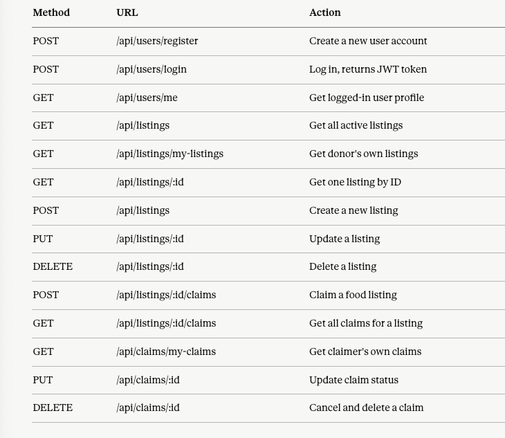

# 🍃 Last Bite

### Last Bite is a full stack web application that connects restaurants and cafes with community members by allowing businesses to post their leftover food at the end of the day. Community members can browse available listings and claim food for free or leave an optional donation.

## Live Demo:

## Features

- User registration and login with role selection (Donor or Claimer)
- JWT-based authentication with bcrypt password hashing
- Donors can create, edit, and delete food listings
- Community members can browse listings and claim food
- Quantity updates automatically when food is claimed
- Listing closes automatically when all portions are claimed
- Quantity restores when a claim is cancelled
- Donor dashboard with listing stats and claim counts
- Claimer dashboard with claim status and pickup tracking
- Ownership-based authorization — users can only modify their own data
- Fully responsive design

## Tech Stack

### Frontend:

- React (Vite)
- React Router DOM
- Axios
- Tailwind CSS

### Backend:

- Node.js
- Express.js
- MongoDB (Atlas)
- JSON Web Tokens (JWT)
- bcrypt

### Deployment:

- Render (Backend as Web service)
- Render (Frontend as Statis Site)

## API Endponts



## Folder Structure

```
last-bite/
├── backend/
│   ├── config/
│   │   └── db.js
│   ├── controllers/
│   │   ├── authController.js
│   │   ├── listingController.js
│   │   └── claimController.js
│   ├── models/
│   │   ├── User.js
│   │   ├── Listing.js
│   │   └── Claim.js
│   ├── routes/
│   │   ├── authRoutes.js
│   │   ├── listingRoutes.js
│   │   └── claimRoutes.js
│   ├── utils/
│   │   └── auth.js
│   ├── .env
│   ├── .gitignore
│   ├── package.json
│   └── server.js
└── frontend/
    ├── src/
    │   ├── assets/
    │   ├── components/
    │   │   ├── ClaimerDashboard.jsx
    │   │   ├── DonorDashboard.jsx
    │   │   ├── ListingCard.jsx
    │   │   └── Navbar.jsx
    │   ├── context/
    │   │   └── AuthContext.jsx
    │   ├── hooks/
    │   │   ├── useClaims.js
    │   │   ├── useListing.js
    │   │   ├── useListings.js
    │   │   └── useMyListings.js
    │   ├── pages/
    │   │   ├── CreateListing.jsx
    │   │   ├── Dashboard.jsx
    │   │   ├── EditListing.jsx
    │   │   ├── Home.jsx
    │   │   ├── Landing.jsx
    │   │   ├── ListingDetail.jsx
    │   │   ├── Login.jsx
    │   │   └── Register.jsx
    │   ├── utils/
    │   │   └── api.js
    │   ├── App.jsx
    │   ├── main.jsx
    │   └── index.css
    ├── .gitignore
    ├── index.html
    └── package.json
```

## Author

Built by Albina Thomas as a capstone project for the MERN stack curriculum
